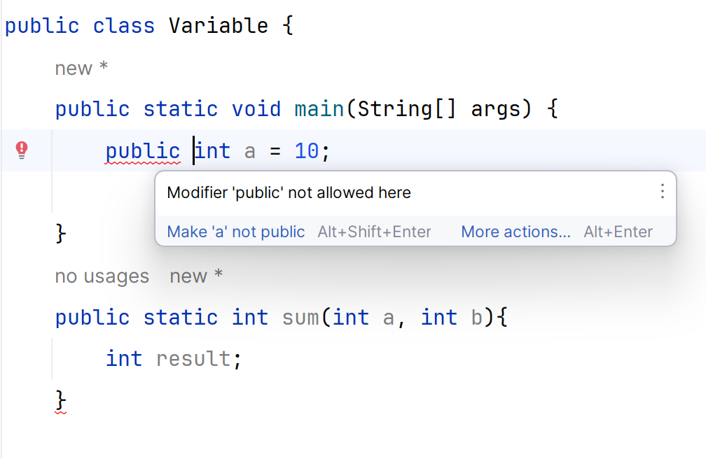
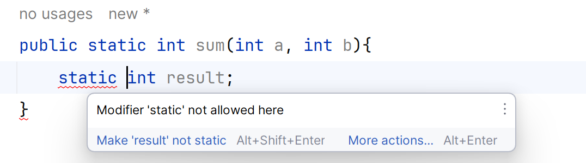
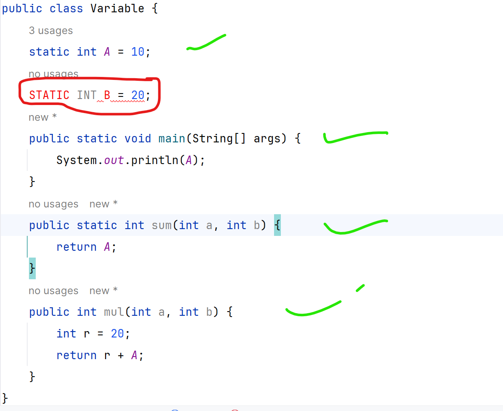
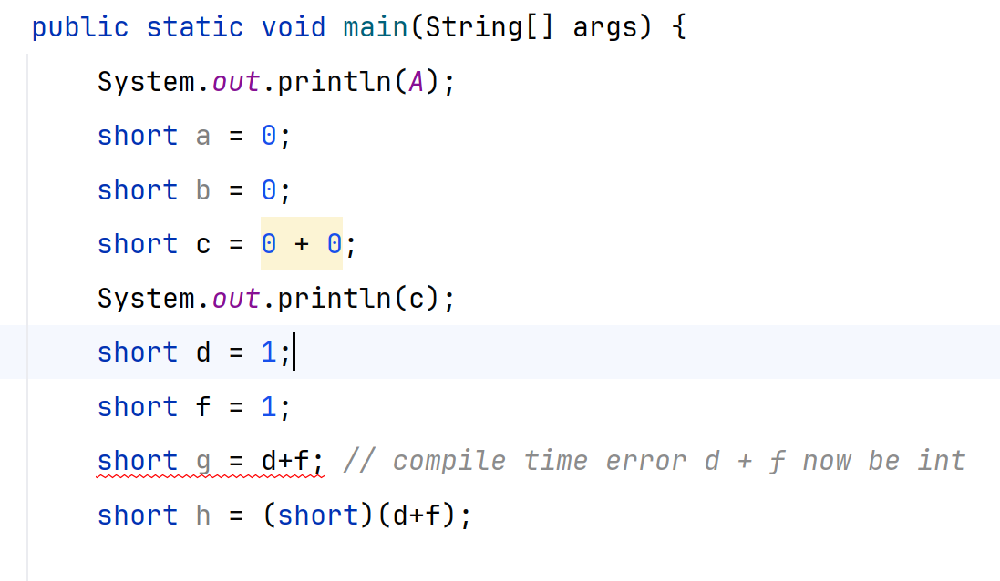

#### https://www.markdownguide.org/cheat-sheet/

#### Read Basic Java block of https://www.javatpoint.com/java-tutorial

## 1.0.0 Naming Conversion

| Identifier | Rule                                                                                                            | Example           |
|:-----------|:----------------------------------------------------------------------------------------------------------------|:------------------|
| Class      | start with the uppercase letter                                                                                 | Employee          |
| Method     | start with Lowercase letter                                                                                     | actionPerformed() |
| Variable   | start with Lowercase letter, it should not start with special characters, avoid one character variable like x,v | firstName         |
| package    | all small case, separate with **.** like com.xyz.xyz                                                            | com.org.telstra   |
| Constant   | All Upper case, separate by **_**                                                                               | MIN_AGE = 18      |

## 1.0.1 Java Memory Management

https://www.javatpoint.com/memory-management-in-java

## 1.0.2 Compile Language VS Interpreted Language

- https://stackoverflow.com/questions/3265357/compiled-vs-interpreted-languages

- https://www.javatpoint.com/jvm-java-virtual-machine

- Interpreter: Read bytecode stream then execute the instructions.

## 1.0.3 History of Java

https://www.javatpoint.com/history-of-java

## 1.0.4 Feature of Java

https://www.javatpoint.com/features-of-java

--------------------------------------------------------

## 1.0.5 Java is always call by value.

- Java supports call by value only. There is no call by reference in java.
- call-by-value means pass-by-vale
- call-by-reference means pass-by-reference

https://sentry.io/answers/java-pass-by-reference-or-value/#:~:text=Modern%20programming%20languages%2C%20such%20as,are%20created%20on%20the%20stack

- check `PassByValue.java` class

- Real pass-by-reference is impossible in Java. Java passes everything by value, including references.
  But you can simulate it with container Objects.

- Use any of these as a method parameter:
    - an array
    - a Collection
    - an AtomicXYZ class

And if you change its contents in a method, the changed contents will be available to the calling context.

--------------------------------------------------------------

## 1.0.6 Valid Java main() method signature

public static void main(String[] args)  
public static void main(String []args)  
public static void main(String args[])  
public static void main(String... args)  
static public void main(String[] args)  
public static final void main(String[] args)  
final public static void main(String[] args)  
final strictfp public static void main(String[] args)

## 1.0.7 Invalid Java main() method signature

public void main(String[] args)  
static void main(String[] args)  
public void static main(String[] args)  
abstract public static void main(String[] args)

## 1.0.8 System Out Println()

https://www.javatpoint.com/system-out-println-in-java

System.out.println() is used to print statement. Here, `System` is a class, `out` is an object of the `PrintStream` class,
`println()` is a method of the `PrintStream` class. We will discuss the internal working of System.out.println() statement
in the coming section.

## 1.0.9 Variables

- https://www.javatpoint.com/java-variables
- A local variable cannot be defined with `static` keyword.

---------------------------------

---------------------------------

---------------------------------

## 1.0.10 Data Type

- 1 bit means 0 or 1
- 1 byte == 8 bit
- everything is 2^n or n/2.
- https://web.stanford.edu/class/cs101/bits-bytes.html
- https://www.cs.uah.edu/~rcoleman/Common/Basics/ASCIICharSet.html
- https://www.cuemath.com/numbers/65-in-binary/

### 1.0.11 primitive type
Java use Unicode system not ASCII code system

| Data Type | Default Value | Size       | Value Store (Range)                                                                                       |
|:----------|:--------------|:-----------|:----------------------------------------------------------------------------------------------------------|
| boolean   | false         | 1 bit      | can't be defined                                                                                          |
| byte      | 0             | 1 byte     | 8 bit ; 2^7 = 128 ; -128 + 127 (because in plus range 0 inclusive) (0 to 7 means 8 bit) (2^0 = 1) (2^1=2) |
| char      | '\u000'       | 2 byte     | 8 bit + 8 bit; '\u0000' (or 0) to '\uffff' (or 65,535 inclusive).                                         | 
| short     | 0             | **2 byte** | 8 bit + 8 bit = 16 bit; 2^15 = 32768; -32768 to 32767                                                     |
| int       | 0             | **4 byte** | 8 * 4 = 32 bit;  - 2,147,483,648 (-2^31) to 2,147,483,647 (2^31 -1)                                       |
| flot      | 0.0f          | **4 byte** | Its value range is unlimited                                                                              |
| long      | 0L            | **8 byte** | 8 * 8 = 64; -9,223,372,036,854,775,808(-2^63) to 9,223,372,036,854,775,807(2^63 -1)                       |
| double    | 0.0d          | **8 byte** | Its value range is unlimited                                                                              |

 

